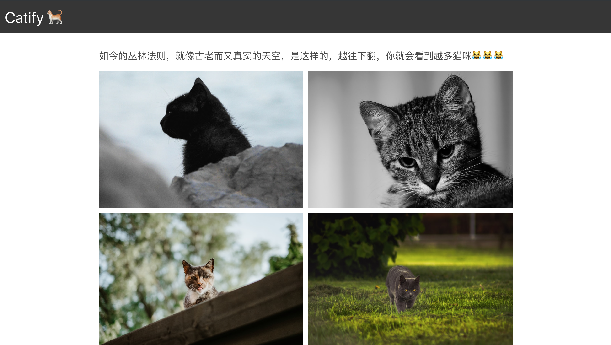

( [Demo](https://catify.netlify.com/) || [Code](https://github.com/teaware/catify) )

**Note:** 本文由 [Build an Infinite Scroll Image Gallery with Gatsby and Netlify Functions](https://scotch.io/tutorials/build-an-infinite-scroll-image-gallery-with-gatsby-and-netlify-functions) 翻译而来，敬请阅读原文

如今静态页面或者 [JAMStack](https://jamstack.org/) 这样的解耦开发架构的趋势如何？为什么许多顶尖的页面和应用程序开始转向使用“静态页面生成器”构建？因为它快速、安全、低成本、开发体验好...

### TL;DR

在这篇文章中，我们将

- 在本地安装并运行 Gatsby
- 在 Gatsby 中创建页面
- 在页面之间使用统一的 layout
- 创建无限滚动图片墙
- 创建一个 Netlify 函数来获取图片
- 在本地部署并使用 Netlify 函数
- 将获取的图片渲染到网格布局中
- 配置 netlify.toml
- 部署到 Netlify

### 为什么使用 Gatsby

[Gatsby](https://www.gatsbyjs.org/) 是一个当下时髦的开源静态页面生成器。它具备构建高性能、安全、低成本、可部署的页面的能力。后面的不翻译了，总之就是很好 😂

### 为什么使用 Netlify

[Netlify](https://www.netlify.com/) 为现代应用程序提供了很好的部署体验，直观、便捷。

### 安装

本教程需要您具备一定的知识，包括 HTML, CSS, JavaScript, 还有 React

Node.js 以及它的包管理工具 NPM 是必需的， 请确认你的机器上是否已经安装

```bash
node -v && npm -v
```

此命令会输出 node 和 npm 的版本号。如果没有妥善安装，请前往 [Node.js](https://nodejs.org/) 下载安装。

安装 Gatsby CLI

```bash
npm i -g gatsby-cli
```

一旦 CLI 工具安装完成，我们就可以在工作路径下创建新的 Gatsby 项目，在命令行工具中输入以下命令

```bash
gatsby new catify
```

该命令会克隆 Gatsby 默认起始页到你的指定文件夹，同时安装该项目的所有依赖包。
接下来我们进入该目录并安装几个新的依赖

```bash
cd catify && npm i --save axios bulma react-infinite-scroll-component
```

如此 我们安装了

- [Axios](https://github.com/axios/axios): 把 HTTP 请求转化成 API 的工具
- [Bulma](https://bulma.io/): 轻量的 CSS 框架
- [React-inifinite-scroll-component](https://www.npmjs.com/package/react-infinite-scroll-component): 一个简单可定制的无限滚动 React 部件

接下来我们运行开发环境服务器：

```bash
gatsby develop
```

### 配置页面布局

页面布局会被视作一个可复用部件来开发。 `components/layout.js` 文件目前输出的是 Gatsby 默认起始页的布局。我们删除它原来的所有内容，引入我们需要的东西

```jsx
import React from "react"
import PropTypes from "prop-types"
import { useStaticQuery, graphql } from "gatsby"

import Header from "./header"
```

这里我们引入了 React, prop-types, useStaticQuery 和 GraphQL 其中 useStaticQuery 是在 Gatsby v2 版本才引进的，正因如此使得我们可以在非页面部件之间使用 GraphQL 数据请求。这些数据获取是静态的且发生在构建过程中，所以使用静态查询（Static Query）这个术语。

包含导航栏的 `Header` 部件（我们稍后创建）也被引入，这里我们先补全 `Layout` 部件的剩余代码

```jsx
const Layout = ({ children }) => {
  const data = useStaticQuery(graphql`
    query SiteTitleQuery {
      site {
        siteMetadata {
          title
        }
      }
    }
  `)

  return (
    <>
      <Header siteTitle={data.site.siteMetadata.title} />
      <div
        style={{
          margin: `0 auto`,
          maxWidth: 900,
          padding: `0px 1.0875rem 1.45rem`,
          paddingTop: 0,
        }}
      >
        <main>{children}</main>
      </div>
    </>
  )
}

Layout.propTypes = {
  children: PropTypes.node.isRequired,
}

export default Layout
```

这里 `useStaticQuery` 用于从 siteMetadata 获取页面标题，`siteTitle` 随即作为参数从 header 部件传递过来。
下一步我们打开位于根目录的 `gatsby-config.js` 文件修改页面标题和描述

```javascript
siteMetadata: {
  title: `Catify`,
  description: `A cat infinite scroll image gallery built with Gatsby, Netify & Unsplash.`,
  author: `@author`
}
```

现在编辑 `components/header.js` 文件

```jsx
import { Link } from "gatsby"
import React from "react"

const Header = ({ siteTitle }) => (
  <header>
    <nav className="navbar is-dark" style={{ marginBottom: "2em" }}>
      <div className="navbar-brand">
        <Link
          to="/"
          style={{
            margin: "0 auto",
            padding: "10px",
          }}
          className="has-text-white is-size-3"
        >
          {siteTitle} 🐈
        </Link>
      </div>
    </nav>
  </header>
)

export default Header
```

### 创建新页面

#### 首页

在 `src/pages/index.js` 文件中删除原有的代码引入依赖项

```jsx {5}
import React from "react"
import { Link } from "gatsby"
import Layout from "../components/layout"
import SEO from "../components/seo"
import "bulma/css/bulma.min.css"
```

注意 Bulma 样式文件的引入方式，接下来定义此部件的导出部分

```jsx
const IndexPage = () => (
  <Layout>
    <SEO title="Home" />
    <div className="has-text-centered" style={{ marginTop: "20%" }}>
      <h1 className="is-size-2">欢迎光临！...喵的世界😹</h1>
      <button className="button is-dark is-large" style={{ marginTop: "10%" }}>
        <Link to="/gallery" className="has-text-white">
          OK 👌
        </Link>
      </button>
    </div>
  </Layout>
)

export default IndexPage
```

我们使用了 Bulma 内建的 class 名称来定义样式

#### 图册页面

在同一路径 `src/pages` 下，新建一个 `gallery.js` 文件。与首页类似，我们引入然后导出...

```jsx
import React from "react"
import Layout from "../components/layout"
import SEO from "../components/seo"
import InfiniteImages from "../components/InfiniteImages"

const Gallery = () => {
  return (
    <Layout>
      <SEO title="Gallery" />
      <h1 className="is-size-5" style={{ marginBottom: "1.0875rem" }}>
        如今的丛林法则，就像古老而又真实的天空，是这样的，越往下翻，你就会看到越多猫咪😹😹😹
      </h1>
      <InfiniteImages />
    </Layout>
  )
}

export default Gallery
```

### 创建图片集

使用 Gatsby 这样的工具好处在于我们可以在部件之间发起 API 请求，并在运行过程中把数据传递到 DOM 让你在静态工作环境中有种异步开发的爽快感。我们将从 [Unsplash](https://unsplash.com/) 获取图片，用 `react-infinite-scroll-component` 实现无限滚动。

在 `src/components` 路径下新建文件 `InfiniteImages.js`

```jsx
import React from "react"
import PropTypes from "prop-types"
import InfiniteScroll from "react-infinite-scroll-component"
```

这个图片集我们需要两个部件

1. 一个部件作为展示图片集的视图
2. 一个部件处理状态，数据抓取并传递到图片集视图

这些部件可以拆分成更多子部件，但为了简单起见我们就保留这两个部件并且把它们写在同一个文件里
在 `InfiniteImages.js` 里创建一个名为 `ImageGallery` 的部件。这个就是图片集视图

```jsx
const ImageGallery = ({ images, loading, fetchImages }) => {
  // Create gallery here
  return (
    <InfiniteScroll
      dataLength={images.length}
      next={() => fetchImages()}
      hasMore={true}
      loader={
        <p style={{ textAlign: "center", marginTop: "1%" }}>
          更多阿猫要来了 🐈🐈...
        </p>
      }
      endMessage={
        <p style={{ textAlign: "center", marginTop: "1%" }}>
          <b>没了没了😸</b>
        </p>
      }
    >
      <div className="image-grid">
        {!loading
          ? images.map(image => (
              <div
                className="image-item"
                key={image.id}
                style={{ backgroundColor: image.color }}
              >
                
              </div>
            ))
          : ""}
      </div>
    </InfiniteScroll>
  )
}
```

在相同路径下，我们新建一个 `gallery.css` 文件来定义图片集的样式

```css
.image-grid {
  display: grid;
  grid-gap: 10px;
  grid-template-columns: repect(auto-fill, minmax(250px, 1fr));
  grid-auto-rows: minmax(50px, auto);
  -webkit-perspective: 1300px;
  perspective: 1300px;
}

.image-grid .image-item:nth-child(5n) {
  grid-column-end: span 2;
}

.image-grid img {
  display: flex;
  width: 100%;
  height: 100%;
  object-fit: cover;
}
```

然后把它引入到 `InfiniteImages.js` 文件

```jsx
import "./gallery.css"
```

接下来我们在 `InfiniteImages.js` 文件中创建一个名为 `InfiniteImages` 的部件
这个部件会用到 React 的 `useState` 和 `useEffect` 钩子来处理状态和生命周期。Axios 也会被用于发起 HTTP 请求。需要引入它们。

```jsx
import React, { useState, useEffect } from "react"
import axios from "axios"
```

引入之后，完成定义 `InfiniteImages` 部件：

```jsx
const InfiniteImages = () => {
  // Hold state
  const [images, setImages] = useState([])
  const [loading, setLoading] = useState(true)

  // Fetch images on component mount
  useEffect(() => {
    fetchImages()
  }, [])

  // Fetch Images from functions
  const fetchImages = () => {
    axios("/.netlify/functions/fetch").then(res => {
      setImages([...images, ...res.data.images])
      setLoading(false)
    })
  }
  return (
    <ImageGallery images={images} loading={loading} fetchImages={fetchImages} />
  )
}
```

指定 `ImageGallery` 的参数类型（Prototypes）并 export `InfiniteImage`

```jsx
import...

const ImageGallery = ({ images, loading, fetchImages }) => {
  // Create gallery here
  return (
    // Component logic here
  )
}

const InfiniteImages = () => {
  // Component logic here
}

ImageGallery.propTypes = {
  images: PropTypes.array,
  loading: PropTypes.bool,
  fetchImages: PropTypes.func,
}

export default InfiniteImages
```

### 创建 Netlify 函数

#### 安装函数构建工具

`netlify-lambda` CLI 可以在本地运行函数也可以部署到服务器。通过以下命令安装 netlify-lambda

```bash
npm i -g netlify-lambda
```

#### 定义 Fetch 函数

在 `src` 路径下新建 `lambda` 文件夹。在根目录新建 `netlify.toml` 文件并写入

```toml
[build]
  Functions = "functions"
```

然后 `src/lambda` 下新建 `fetch.js`

```jsx
import axios from "axios"
import config from "../../config"

exports.handler = function(event, context, callback) {
  const apiRoot = "https://api.unsplash.com"
  const accessKey = process.env.ACCESS_KEY || config.accessKey

  const catEndpoint = `${apiRoot}/photos/random?client_id=${accessKey}&count=${10}&collections='4365121,1043053'`

  axios.get(catEndpoint).then(res => {
    callback(null, {
      statusCode: 200,
      body: JSON.stringify({
        images: res.data,
      }),
    })
  })
}
```

在根目录新建 `config.js` 文件保存从 Unsplash 生成的 API 密钥

```jsx
const config = {
  accessKey: "<Add access key>",
}

export default config
```

确保你把该文件添加到 `.gitignore` 以免被添加到你的 repo
在本地运行服务器

```bash
netlify-lambda serve src/lambda
```

在浏览器中打开 [`http://localhost:9000/fetch`](http://localhost:9000/fetch) 可以看到从 API 获得的数据
输入以下指令，创建 build 版本以便于部署

```bash
netlify-lambda build src/lambda
```

#### 在本地运行

在本地开发环执行 API 请求会遇到 CORS 错误，那么 [http-proxy-middleware](https://github.com/chimurai/http-proxy-middleware) 会解决我们的难题么？

```bash
npm i --save-dev http-proxy-middleware
```

在 `gatsby-config.js` 中

```jsx
let proxy = require("http-proxy-middleware")

module.exports = {
  siteMetadata: {
    // define site metadata
  },
  // Enables the use of function URLs locally
  developMiddleware: app => {
    app.use(
      "/.netlify/functions/",
      proxy({
        target: "http://localhost:9000",
        pathRewrite: { "/.netlify/functions/": "" },
      })
    )
  },
  plugins: [
    // define plugins
  ],
}
```

然后在 `src/components/InfiniteImages.js` 中

```jsx
import // ...

const ImageGallery = ({ images, loading, fetchImages }) => {
  // Component logic here
}

const InfiniteImages = () => {
  // Hold state
  const [images, setImages] = useState([])
  const [loading, setLoading] = useState(true)

  // Fetch images on component mount
  useEffect(() => {
    fetchImages()
  }, [])

  // Fetch Images from functions
  const fetchImages = () => {
    axios("/.netlify/functions/fetch").then(res => {
      setImages([...images, ...res.data.images])
      setLoading(false)
    })
  }
  return (
    <ImageGallery images={images} loading={loading} fetchImages={fetchImages} />
  )
}

ImageGallery.propTypes = {
    // Define proptypes
}

export default InfiniteImages
```

重启 Gatsby 本地服务器 此时在本地也可以看到我们的 app 正常运行了

### 部署到 Netlify

两个 build 动作

```bash
netlify-lambda build src/lambda
```

```bash
gatsby build
```

#### 推送到 GitHub

在 [GitHub](https://github.com/) 新建一个 repo 然后推送...

#### Netlify

在 [Netlify](https://www.netlify.com/) 创建账户，然后点击 "New site from Git" 按钮，部署过程非常简单，自己研究吧。

( [Demo](https://catify.netlify.com/) || [Code](https://github.com/teaware/catify) )
